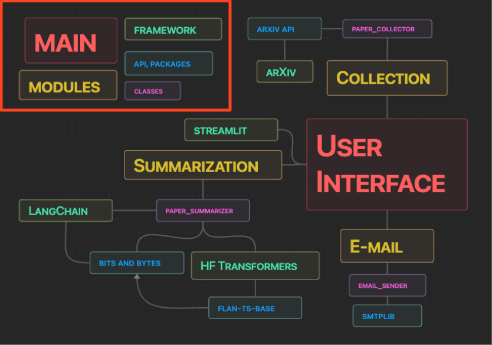

# aiffelthon
aiffelthon - AccioPaper

## Overall Structure

### Collecting Papers

#### Class: PaperCollector

- Collecting 1,000 papers
- Using arXiv API

#### arXiv API
- [PyPI](https://pypi.org/project/arxiv/)
- [API Documentation](https://lukasschwab.me/arxiv.py/arxiv.html)

### Summarization

#### Class PaperSummarizer

- Summarizing a paper 
- chunk size: 512
- Language Model: flan-t5-base finetuned with arxiv dataset of scientific-papers on huggingface

#### Language Model
- [flan-t5-base-finetuned-arxiv](https://huggingface.co/knachinen/flan-t5-base-finetuned-arxiv)
- [flan-t5-xl-finetuned-arxiv](https://huggingface.co/knachinen/flan-t5-xl-finetuned-arxiv)

### Email
- Class: EmailSender
- Python smtplib
- Email account setting: ./preferences/email_account.json

## Development Environment
- PEFT 0.5.0
- Transformers 4.35.0
- Pytorch 1.10.1+cu111
- Datasets 2.14.7
- Tokenizers 0.14.1
- bitsandbytes 0.41.2.post2
- accelerate 0.24.0
- evaluate 0.4.1
- rouge-score 0.1.2